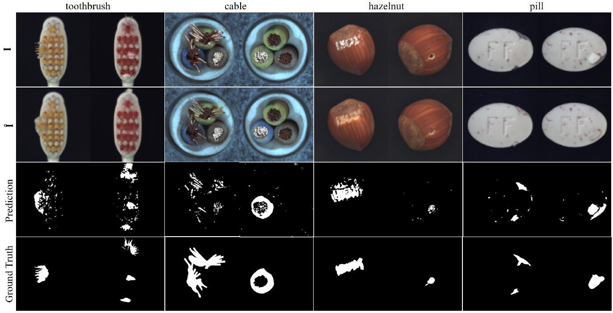

# P-Net for Anomaly Detection (Pytorch)

This is the implementation of our paper on MvTec dataset:

Kang Zhou*, Yuting Xiao*, Jianlong Yang, Jun Cheng, Wen Liu, Weixin Luo, Zaiwang Gu, 
Jiang Liu, Shenghua Gao. 
Encoding Structure-Texture Relation with P-Net for Anomaly Detection in Retinal Images. ECCV 2020. 
[* indicates equal contribution]


## Introduction
This is the main P-Net implementation on Mvtec dataset. It consist of 2 parts: 1.Structure extraction
pretrain. 2. Main P-Net. The complete version on medical image dataset
can be found at https://github.com/ClancyZhou/P_Net_Anomaly_Detection
 
### Environment
This code is available on Python 3.6, PyTorch 1.4, torchvision 0.5, cuda 10.1.

Install the packages in the project:
```
pip install -r requirements.txt 
```
## Download Dataset
The dataset can be downloaded [here](https://www.mvtec.com/company/research/datasets/mvtec-ad/).

## Prepare
We use visdom to visualize the result. You can find the details of visdom at 
[here](https://github.com/facebookresearch/visdom/).

Modify the detail

## Getting started
We provide an example on cable clss of Mvtec dataset to show how to train and test our model.
### Structure Extraction Pretrain
Pretrain the structure extractor.
```
python main_Stru.py      \
            --version cable_Stru --port 31670\
            --n_epochs 800  --save_model_freq 500  --lr 0.0001  --canny_sigma 1  \
            --save_image_freq 150 --val_freq 10 --batch 24 \
            --lamd_gen 0.1   --lamd_fm 0  --lamd_pixel 1 \
            --crop_rate 0 --gpu 0  --data_modality cable
```
### Train P-Net
Train main P-Net on cable class of Mvtec
```
python main_PNet.py      \
          --version cable_PNet --port 31670 \
          --Stru_resume latest_ckpt.pth.tar \
          --Stru_load_version cable_Stru \
          --save_image_freq 790 --save_model_freq 9999  --val_freq 5\
          --lr 0.0002  --batch 18  --val_freq 5 --n_epochs 800 \
          --lamd_gen 1   --lamd_fm 0.01  --lamd_pixel 1 --gau_sigma 1.5 --pixpow 4 '
          --gpu 0 --data_modality cable
```
### Test P-Net
```
python main_PNet.py      \
          --version cable_PNet --port 31670 \
          --resume latest_ckpt.pth.tar \
          --test \
          --Stru_resume latest_ckpt.pth.tar \
          --Stru_load_version cable_Stru \
          --save_image_freq 790 --save_model_freq 9999  --val_freq 5\
          --lr 0.0002  --batch 18  --val_freq 5 --n_epochs 800 \
          --lamd_gen 1   --lamd_fm 0.01  --lamd_pixel 1 --gau_sigma 1.5 --pixpow 4 \
          --gpu 0 --data_modality cable
```
If you want to use canny edge detector as structure extractor, you can add the command `--use_canny`.
## BibTeX 


If you use this code in your project, please cite our paper:
````
@inproceedings{zhou2020encoding,
  title={Encoding Structure-Texture Relation with P-Net for Anomaly Detection in Retinal Images},
  author={Kang Zhou*, Yuting Xiao*, Jianlong Yang, Jun Cheng, Wen Liu, Weixin Luo, Zaiwang Gu, Jiang Liu, Shenghua Gao.},
  booktitle={European Conference on Computer Vision (ECCV)},
  year={2020}
}
````


